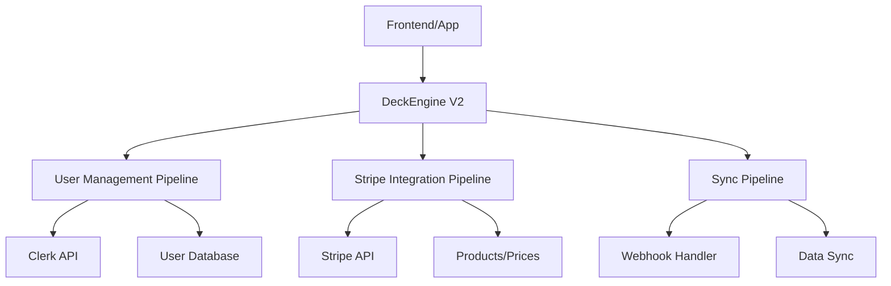

# 🎮 Tutorial: User Management + Stripe Integration

## 🚀 **Visão Geral**

Este tutorial demonstra como implementar **User Management** e **Stripe Integration** usando o DeckEngine V2 para criar pipelines robustos de:

- 👤 **Gestão de Usuários** (registro, autenticação, perfis)
- 💳 **Pagamentos Stripe** (produtos, assinaturas, webhooks)
- 🔄 **Sincronização** entre sistemas (Clerk + Stripe + Database)

---

## 📋 **Pré-requisitos**

### **Tecnologias**

- ✅ **Node.js** 14+
- ✅ **DeckEngine V2** (instalado)
- ✅ **Clerk** (autenticação)
- ✅ **Stripe** (pagamentos)
- ✅ **Database** (PostgreSQL/MongoDB)

### **Configurações**

```bash
# Instalar DeckEngine V2
npm install pipesnow-deck-engine

# Variáveis de ambiente necessárias
CLERK_SECRET_KEY=clerk_sk_...
STRIPE_SECRET_KEY=sk_...
DATABASE_URL=postgresql://...
```

---

## 🎯 **Arquitetura do Sistema**



### **Domínios do DeckEngine V2**

- 🔐 **Authentication Domain**: Login, registro, verificação
- 👤 **User Management Domain**: CRUD de usuários, perfis
- 💳 **Payment Domain**: Processamento de pagamentos
- 🔄 **System Domain**: Sincronização, health checks

---

## 👤 **Parte 1: User Management Pipeline**

### **1.1 Configuração Inicial**

```javascript
const DeckEngine = require("pipesnow-deck-engine");

// Inicializar engine V2 com domains padrão
const engine = new DeckEngine({
  version: "v2",
  standardDomains: ["authentication", "user-management", "system"],
  logging: ["console", "file"],
});
```

### **1.2 Pipeline de Registro de Usuário**

```javascript
// Criar deck de registro
const userRegistrationDeck = engine.createDeck("user-registration", {
  concurrency: 3,
  timeout: 30000,
  retries: 2,
});

userRegistrationDeck

  // 🔍 Validar dados de entrada
  .addCard("validate-input", async (context) => {
    const { email, password, name, metadata = {} } = context;

    // Validações
    if (!email || !email.includes("@")) {
      throw new Error("Email inválido");
    }

    if (!password || password.length < 8) {
      throw new Error("Senha deve ter pelo menos 8 caracteres");
    }

    if (!name || name.length < 2) {
      throw new Error("Nome deve ter pelo menos 2 caracteres");
    }

    return {
      ...context,
      sanitizedData: {
        email: email.toLowerCase().trim(),
        name: name.trim(),
        metadata: {
          ...metadata,
          registrationSource: "web_form",
          registrationDate: new Date().toISOString(),
        },
      },
      validated: true,
    };
  })

  // 👥 Verificar usuário existente
  .addCard("check-existing-user", async (context) => {
    // Integração com Clerk
    const { users } = require("@clerk/clerk-sdk-node");

    try {
      const existingUser = await users.getUserList({
        emailAddress: [context.sanitizedData.email],
      });

      if (existingUser.length > 0) {
        throw new Error("Usuário já existe com este email");
      }

      return {
        ...context,
        userExists: false,
        checkedAt: new Date().toISOString(),
      };
    } catch (error) {
      if (error.message.includes("já existe")) {
        throw error;
      }
      // Log erro e continua (Clerk pode estar temporariamente indisponível)
      console.warn(
        "Aviso: Não foi possível verificar usuário existente",
        error.message
      );
      return { ...context, userExists: false, warning: "clerk_unavailable" };
    }
  })

  // 🔐 Criar usuário no Clerk
  .addCard("create-clerk-user", async (context) => {
    const { users } = require("@clerk/clerk-sdk-node");

    const clerkUser = await users.createUser({
      emailAddress: [context.sanitizedData.email],
      password: context.password,
      firstName: context.sanitizedData.name.split(" ")[0],
      lastName: context.sanitizedData.name.split(" ").slice(1).join(" "),
      publicMetadata: context.sanitizedData.metadata,
      privateMetadata: {
        internalUserId: `user_${Date.now()}`,
        createdVia: "registration_pipeline",
      },
    });

    return {
      ...context,
      clerkUser: {
        id: clerkUser.id,
        emailAddress: clerkUser.emailAddresses[0]?.emailAddress,
        createdAt: clerkUser.createdAt,
      },
      clerkCreated: true,
    };
  })

  // 💾 Salvar no database local
  .addCard("save-to-database", async (context) => {
    // Simular integração com database
    const userData = {
      id: context.clerkUser.id,
      email: context.sanitizedData.email,
      name: context.sanitizedData.name,
      clerkId: context.clerkUser.id,
      status: "active",
      plan: "free",
      metadata: context.sanitizedData.metadata,
      createdAt: new Date().toISOString(),
      updatedAt: new Date().toISOString(),
    };

    // Simular INSERT no database
    console.log("💾 Salvando usuário no database:", userData.id);

    return {
      ...context,
      userData,
      savedToDatabase: true,
    };
  })

  // 📧 Enviar email de boas-vindas
  .addCard("send-welcome-email", async (context) => {
    // Simular envio via SendGrid/similar
    const emailData = {
      to: context.sanitizedData.email,
      subject: "Bem-vindo!",
      template: "welcome",
      personalizations: {
        name: context.sanitizedData.name,
        userId: context.userData.id,
        loginUrl: "https://app.exemplo.com/login",
      },
    };

    console.log("📧 Enviando email de boas-vindas para:", emailData.to);

    return {
      ...context,
      emailSent: true,
      emailData,
      completed: true,
    };
  });
```

### **1.3 Pipeline de Atualização de Perfil**

```javascript
// Deck para atualizar perfil do usuário
const userUpdateDeck = engine.createDeck("user-profile-update", {
  concurrency: 2,
  timeout: 20000,
});

userUpdateDeck

  // 🔍 Validar dados e permissões
  .addCard("validate-update-data", async (context) => {
    const { userId, updates, requestingUserId } = context;

    // Verificar se é o próprio usuário ou admin
    if (userId !== requestingUserId && !context.isAdmin) {
      throw new Error("Sem permissão para atualizar este usuário");
    }

    // Validar campos permitidos
    const allowedFields = ["name", "metadata", "avatar"];
    const filteredUpdates = {};

    Object.keys(updates).forEach((key) => {
      if (allowedFields.includes(key)) {
        filteredUpdates[key] = updates[key];
      }
    });

    return {
      ...context,
      validatedUpdates: filteredUpdates,
      validated: true,
    };
  })

  // 🔄 Atualizar no Clerk
  .addCard("update-clerk-user", async (context) => {
    const { users } = require("@clerk/clerk-sdk-node");

    const updateData = {};

    if (context.validatedUpdates.name) {
      const nameParts = context.validatedUpdates.name.split(" ");
      updateData.firstName = nameParts[0];
      updateData.lastName = nameParts.slice(1).join(" ");
    }

    if (context.validatedUpdates.metadata) {
      updateData.publicMetadata = {
        ...context.userData.metadata,
        ...context.validatedUpdates.metadata,
      };
    }

    const updatedUser = await users.updateUser(context.userId, updateData);

    return {
      ...context,
      clerkUpdated: true,
      updatedClerkData: updatedUser,
    };
  })

  // 💾 Atualizar database local
  .addCard("update-local-database", async (context) => {
    // Simular UPDATE no database
    const updateData = {
      ...context.validatedUpdates,
      updatedAt: new Date().toISOString(),
    };

    console.log("💾 Atualizando usuário no database:", context.userId);

    return {
      ...context,
      databaseUpdated: true,
      updateData,
      completed: true,
    };
  });
```

---

## 💳 **Parte 2: Stripe Integration Pipeline**

### **2.1 Configuração do Stripe**

```javascript
const stripe = require("stripe")(process.env.STRIPE_SECRET_KEY);

// Deck para gerenciar produtos
const stripeProductDeck = engine.createDeck("stripe-product-management", {
  concurrency: 1, // Sequencial para consistência
  timeout: 30000,
});
```

### **2.2 Pipeline de Compra de Produto**

```javascript
// Deck para processar compras
const purchaseDeck = engine.createDeck("process-purchase", {
  concurrency: 1,
  timeout: 45000,
});

purchaseDeck

  // 🔍 Validar dados da compra
  .addCard("validate-purchase-data", async (context) => {
    const {
      productId,
      priceId,
      customerId,
      quantity = 1,
      paymentMethodId,
    } = context;

    if (!productId) throw new Error("Product ID é obrigatório");
    if (!priceId) throw new Error("Price ID é obrigatório");
    if (!customerId) throw new Error("Customer ID é obrigatório");
    if (!paymentMethodId) throw new Error("Payment Method é obrigatório");

    return {
      ...context,
      purchaseData: {
        productId,
        priceId,
        customerId,
        quantity: parseInt(quantity),
        paymentMethodId,
      },
      validated: true,
    };
  })

  // 📦 Buscar produto no Stripe
  .addCard("fetch-stripe-product", async (context) => {
    const product = await stripe.products.retrieve(
      context.purchaseData.productId
    );

    if (!product.active) {
      throw new Error("Produto não está disponível");
    }

    return {
      ...context,
      product: {
        id: product.id,
        name: product.name,
        description: product.description,
        metadata: product.metadata,
      },
    };
  })

  // 💰 Buscar preço no Stripe
  .addCard("fetch-stripe-price", async (context) => {
    const price = await stripe.prices.retrieve(context.purchaseData.priceId);

    if (!price.active) {
      throw new Error("Preço não está disponível");
    }

    const totalAmount = price.unit_amount * context.purchaseData.quantity;

    return {
      ...context,
      price: {
        id: price.id,
        amount: price.unit_amount,
        currency: price.currency,
        recurring: price.recurring,
      },
      totalAmount,
    };
  })

  // 👤 Verificar customer no Stripe
  .addCard("verify-stripe-customer", async (context) => {
    const customer = await stripe.customers.retrieve(
      context.purchaseData.customerId
    );

    return {
      ...context,
      customer: {
        id: customer.id,
        email: customer.email,
        name: customer.name,
      },
    };
  })

  // 💳 Criar Payment Intent
  .addCard("create-payment-intent", async (context) => {
    const paymentIntentData = {
      amount: context.totalAmount,
      currency: context.price.currency,
      customer: context.customer.id,
      payment_method: context.purchaseData.paymentMethodId,
      metadata: {
        product_id: context.product.id,
        price_id: context.price.id,
        quantity: context.purchaseData.quantity.toString(),
        user_id: context.customer.id,
      },
      confirm: true, // Confirmar imediatamente
      return_url: "https://app.exemplo.com/payment-complete",
    };

    // Para assinaturas recorrentes
    if (context.price.recurring) {
      // Criar subscription ao invés de payment intent
      const subscription = await stripe.subscriptions.create({
        customer: context.customer.id,
        items: [
          {
            price: context.price.id,
            quantity: context.purchaseData.quantity,
          },
        ],
        default_payment_method: context.purchaseData.paymentMethodId,
        metadata: paymentIntentData.metadata,
      });

      return {
        ...context,
        subscription,
        isRecurring: true,
        paymentType: "subscription",
      };
    } else {
      // Pagamento único
      const paymentIntent = await stripe.paymentIntents.create(
        paymentIntentData
      );

      return {
        ...context,
        paymentIntent,
        isRecurring: false,
        paymentType: "one_time",
      };
    }
  })

  // ✅ Processar confirmação
  .addCard("process-payment-confirmation", async (context) => {
    let paymentConfirmed = false;
    let paymentData = {};

    if (context.isRecurring) {
      // Verificar status da subscription
      paymentConfirmed = ["active", "trialing"].includes(
        context.subscription.status
      );
      paymentData = {
        subscriptionId: context.subscription.id,
        status: context.subscription.status,
        currentPeriodEnd: context.subscription.current_period_end,
      };
    } else {
      // Verificar status do payment intent
      paymentConfirmed = context.paymentIntent.status === "succeeded";
      paymentData = {
        paymentIntentId: context.paymentIntent.id,
        status: context.paymentIntent.status,
        charges: context.paymentIntent.charges?.data || [],
      };
    }

    if (!paymentConfirmed) {
      throw new Error("Pagamento não foi confirmado");
    }

    return {
      ...context,
      paymentConfirmed: true,
      paymentData,
      confirmedAt: new Date().toISOString(),
    };
  })

  // 💾 Atualizar database local
  .addCard("update-user-subscription", async (context) => {
    // Atualizar registro do usuário no database local
    const subscriptionData = {
      userId: context.customer.id,
      productId: context.product.id,
      priceId: context.price.id,
      paymentType: context.paymentType,
      status: "active",
      amount: context.totalAmount,
      currency: context.price.currency,
      isRecurring: context.isRecurring,
      paymentData: context.paymentData,
      purchasedAt: new Date().toISOString(),
    };

    console.log("💾 Salvando compra no database:", subscriptionData);

    return {
      ...context,
      subscriptionData,
      savedToDatabase: true,
    };
  })

  // 📧 Enviar confirmação por email
  .addCard("send-purchase-confirmation", async (context) => {
    const emailData = {
      to: context.customer.email,
      subject: "Compra confirmada!",
      template: "purchase_confirmation",
      data: {
        customerName: context.customer.name,
        productName: context.product.name,
        amount: (context.totalAmount / 100).toFixed(2),
        currency: context.price.currency.toUpperCase(),
        isRecurring: context.isRecurring,
        receiptUrl: context.paymentData.charges?.[0]?.receipt_url,
      },
    };

    console.log("📧 Enviando confirmação de compra para:", emailData.to);

    return {
      ...context,
      emailSent: true,
      emailData,
      completed: true,
    };
  });
```

---

## 🔄 **Parte 3: Pipeline de Sincronização**

### **3.1 Sincronização Clerk ↔ Stripe**

```javascript
// Deck para sincronizar dados entre Clerk e Stripe
const syncDeck = engine.createDeck("clerk-stripe-sync", {
  concurrency: 2,
  timeout: 60000,
});

syncDeck

  // 📥 Buscar usuários do Clerk
  .addCard("fetch-clerk-users", async (context) => {
    const { users } = require("@clerk/clerk-sdk-node");

    const userList = await users.getUserList({
      limit: context.limit || 100,
      offset: context.offset || 0,
    });

    return {
      ...context,
      clerkUsers: userList,
      totalUsers: userList.length,
    };
  })

  // 🔍 Verificar customers no Stripe
  .addCard("check-stripe-customers", async (context) => {
    const syncResults = [];

    for (const clerkUser of context.clerkUsers) {
      const email = clerkUser.emailAddresses[0]?.emailAddress;

      if (!email) continue;

      try {
        // Buscar customer por email
        const customers = await stripe.customers.list({
          email: email,
          limit: 1,
        });

        let stripeCustomer = customers.data[0];

        // Criar customer se não existir
        if (!stripeCustomer) {
          stripeCustomer = await stripe.customers.create({
            email: email,
            name: `${clerkUser.firstName} ${clerkUser.lastName}`.trim(),
            metadata: {
              clerk_id: clerkUser.id,
              synced_at: new Date().toISOString(),
            },
          });
        }

        syncResults.push({
          clerkId: clerkUser.id,
          stripeCustomerId: stripeCustomer.id,
          email: email,
          synced: true,
        });
      } catch (error) {
        syncResults.push({
          clerkId: clerkUser.id,
          email: email,
          error: error.message,
          synced: false,
        });
      }
    }

    return {
      ...context,
      syncResults,
      successfulSyncs: syncResults.filter((r) => r.synced).length,
      failedSyncs: syncResults.filter((r) => !r.synced).length,
    };
  })

  // 🔄 Atualizar metadados no Clerk
  .addCard("update-clerk-metadata", async (context) => {
    const { users } = require("@clerk/clerk-sdk-node");

    for (const result of context.syncResults) {
      if (result.synced && result.stripeCustomerId) {
        try {
          await users.updateUser(result.clerkId, {
            privateMetadata: {
              stripe_customer_id: result.stripeCustomerId,
              last_sync: new Date().toISOString(),
            },
          });
        } catch (error) {
          console.warn(
            `Erro ao atualizar metadata do Clerk para ${result.clerkId}:`,
            error.message
          );
        }
      }
    }

    return {
      ...context,
      metadataUpdated: true,
      completed: true,
    };
  });
```

---

## 🎯 **Parte 4: Uso Prático**

### **4.1 Exemplo de Registro Completo**

```javascript
async function registrarNovoUsuario(dadosUsuario) {
  try {
    console.log("👤 Iniciando registro de usuário...");

    const resultado = await engine.playMatch("user-registration", {
      email: dadosUsuario.email,
      password: dadosUsuario.password,
      name: dadosUsuario.name,
      metadata: {
        plano: "free",
        origem: "website",
      },
    });

    if (resultado.success) {
      console.log("✅ Usuário registrado com sucesso!");
      console.log("🆔 ID do usuário:", resultado.result.userData.id);
      return resultado.result.userData;
    } else {
      throw new Error("Falha no registro: " + resultado.errors);
    }
  } catch (error) {
    console.error("❌ Erro no registro:", error.message);
    throw error;
  }
}

// Usar a função
registrarNovoUsuario({
  email: "usuario@exemplo.com",
  password: "senhaSegura123",
  name: "João Silva",
});
```

### **4.2 Exemplo de Compra com Stripe**

```javascript
async function processarCompra(dadosCompra) {
  try {
    console.log("💳 Processando compra...");

    const resultado = await engine.playMatch("process-purchase", {
      productId: "prod_exemplo123",
      priceId: "price_exemplo456",
      customerId: dadosCompra.customerId,
      paymentMethodId: dadosCompra.paymentMethodId,
      quantity: 1,
    });

    if (resultado.success) {
      console.log("✅ Compra processada com sucesso!");

      if (resultado.result.isRecurring) {
        console.log("🔄 Assinatura criada:", resultado.result.subscription.id);
      } else {
        console.log(
          "💰 Pagamento único processado:",
          resultado.result.paymentIntent.id
        );
      }

      return resultado.result;
    } else {
      throw new Error("Falha na compra: " + resultado.errors);
    }
  } catch (error) {
    console.error("❌ Erro na compra:", error.message);
    throw error;
  }
}
```

### **4.3 Exemplo de Sincronização**

```javascript
async function sincronizarSistemas() {
  try {
    console.log("🔄 Iniciando sincronização Clerk ↔ Stripe...");

    const resultado = await engine.playMatch("clerk-stripe-sync", {
      limit: 50,
      offset: 0,
    });

    if (resultado.success) {
      console.log("✅ Sincronização concluída!");
      console.log(
        `📊 ${resultado.result.successfulSyncs} usuários sincronizados`
      );
      console.log(`❌ ${resultado.result.failedSyncs} falhas`);
      return resultado.result;
    } else {
      throw new Error("Falha na sincronização: " + resultado.errors);
    }
  } catch (error) {
    console.error("❌ Erro na sincronização:", error.message);
    throw error;
  }
}

// Executar sincronização a cada 6 horas
setInterval(sincronizarSistemas, 6 * 60 * 60 * 1000);
```

---

## 🛠️ **Parte 5: CLI e Automação**

### **5.1 Usando o CLI para Desenvolvimento**

```bash
# Criar templates prontos
deck-engine create-user-deck user-management
deck-engine create-stripe-deck stripe-payments

# Listar todos os decks
deck-engine list

# Executar pipelines
deck-engine run user-management
deck-engine run stripe-payments

# Verificar saúde do sistema
deck-engine health
```

### **5.2 Integração com Webhooks**

```javascript
// Deck para processar webhooks do Stripe
const webhookDeck = engine.createDeck("stripe-webhook-processor", {
  concurrency: 5,
  timeout: 15000,
});

webhookDeck

  .addCard("verify-webhook-signature", async (context) => {
    const { rawBody, signature, endpointSecret } = context;

    try {
      const event = stripe.webhooks.constructEvent(
        rawBody,
        signature,
        endpointSecret
      );

      return {
        ...context,
        event,
        verified: true,
      };
    } catch (error) {
      throw new Error("Webhook signature verification failed");
    }
  })

  .addCard("process-webhook-event", async (context) => {
    const { event } = context;

    switch (event.type) {
      case "customer.subscription.created":
        return await processSubscriptionCreated(context);
      case "customer.subscription.updated":
        return await processSubscriptionUpdated(context);
      case "invoice.payment_succeeded":
        return await processPaymentSucceeded(context);
      case "invoice.payment_failed":
        return await processPaymentFailed(context);
      default:
        return { ...context, processed: false, reason: "event_not_handled" };
    }
  });

// Usar em Express/Next.js
app.post("/webhooks/stripe", async (req, res) => {
  try {
    const result = await engine.playMatch("stripe-webhook-processor", {
      rawBody: req.body,
      signature: req.headers["stripe-signature"],
      endpointSecret: process.env.STRIPE_WEBHOOK_SECRET,
    });

    res.json({ received: true });
  } catch (error) {
    console.error("Webhook error:", error.message);
    res.status(400).json({ error: error.message });
  }
});
```

---

## 📊 **Parte 6: Monitoramento e Métricas**

### **6.1 Health Checks**

```javascript
// Verificar saúde de todos os sistemas
async function verificarSaude() {
  const health = engine.healthCheck();

  console.log("🏥 Status do Sistema:", health.status);
  console.log("🔐 Domains ativos:", health.system.domains.total);
  console.log("🎴 Decks carregados:", health.system.decks.total);

  // Verificações específicas
  if (health.system.domains.total === 0) {
    console.warn("⚠️ Nenhum domain ativo");
  }

  return health;
}

// Executar a cada 5 minutos
setInterval(verificarSaude, 5 * 60 * 1000);
```

### **6.2 Métricas Personalizadas**

```javascript
// Deck para coletar métricas
const metricsDeck = engine.createDeck("collect-metrics", {
  concurrency: 1,
  timeout: 10000,
});

metricsDeck

  .addCard("count-active-users", async (context) => {
    // Simular contagem de usuários ativos
    const activeUsers = Math.floor(Math.random() * 1000) + 100;
    return { ...context, activeUsers };
  })

  .addCard("calculate-revenue", async (context) => {
    // Simular cálculo de receita
    const revenue = Math.floor(Math.random() * 50000) + 10000;
    return { ...context, revenue };
  })

  .addCard("check-system-performance", async (context) => {
    const performance = {
      averageResponseTime: Math.floor(Math.random() * 500) + 100,
      errorRate: Math.random() * 0.05, // 0-5%
      throughput: Math.floor(Math.random() * 1000) + 500,
    };

    return { ...context, performance };
  });
```

---

## 🎉 **Conclusão**

Parabéns! Você agora tem um sistema completo de **User Management** e **Stripe Integration** usando o DeckEngine V2.

### **🎯 O que você implementou:**

- ✅ **Pipeline de Registro**: Validação → Clerk → Database → Email
- ✅ **Pipeline de Compras**: Validação → Stripe → Confirmação → Notificação
- ✅ **Sincronização**: Clerk ↔ Stripe ↔ Database
- ✅ **Webhooks**: Processamento automático de eventos
- ✅ **Monitoramento**: Health checks e métricas

### **🚀 Próximos Passos:**

1. **Adicionar testes** para cada pipeline
2. **Implementar retry policies** personalizadas
3. **Configurar alertas** para falhas
4. **Escalar** para múltiplas instâncias
5. **Adicionar mais integrações** (SendGrid, Cloudinary, etc.)

### **📚 Recursos Úteis:**

- 📖 [Documentação V2](README.md)
- 🎮 [CLI Reference](../bin/deck-engine)
- 🔧 [Health Monitoring](../simple-test.js)

---

**🎮 DeckEngine V2** - Transformando integrações complexas em pipelines simples e confiáveis! 🚀
