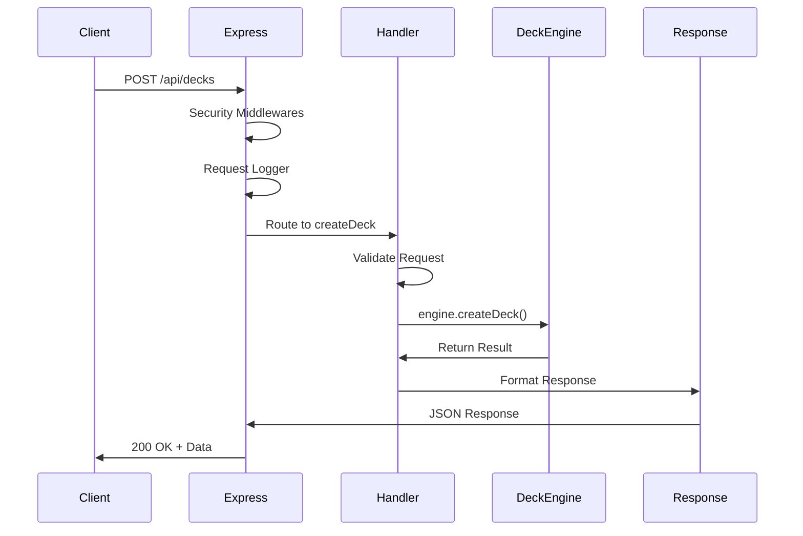

# 🏗️ Arquitetura DeckEngine API

> **Arquitetura Híbrida**: Express como adaptador puro do DeckEngine core com preparação para funcionalidades enterprise

## 🎯 **Filosofia da Arquitetura**

### **Express como Adaptador Puro**

- ✅ **Zero interferência** no DeckEngine core
- ✅ **Estrutura enxuta** - handlers + routes
- ✅ **Escalabilidade preparada** para funcionalidades enterprise
- ✅ **Gaming metaphors** preservadas em toda API

## 📁 **Estrutura de Diretórios**

```
server/
├── 🎯 server.js                    # Entry point principal
├── ⚙️ config/
│   ├── express.js                  # Configuração modular do Express
│   └── environment.js              # Variáveis de ambiente
├── 🛡️ middlewares/                 # Middlewares customizados
│   ├── request-logger.js           # Logging estruturado
│   ├── error-handler.js            # Error handling centralizado
│   └── auth.js                     # Autenticação (preparado)
├── 🎮 routes/                      # Rotas organizadas por domínio
│   ├── index.js                    # Router principal
│   ├── decks.js                    # Rotas de decks
│   ├── matches.js                  # Rotas de matches
│   └── system.js                   # Rotas de sistema
├── 🎯 handlers/                    # Lógica req/res + DeckEngine calls
│   ├── decks.js                    # Handlers de deck management
│   ├── matches.js                  # Handlers de match execution
│   └── system.js                   # Handlers de system operations
├── 🔧 utils/
│   └── response.js                 # Utilitários de response padronizada
├── 📖 docs/                        # Documentação completa
│   ├── ARCHITECTURE.md             # Este arquivo
│   ├── ROADMAP.md                  # Roadmap detalhado
│   ├── ADMIN-GUIDE.md              # Guia administrativo
│   ├── USER-BILLING-GUIDE.md       # User management & billing
│   └── DEPLOYMENT-GUIDE.md         # Deploy em produção
├── 📦 package.json                 # Dependencies e scripts
└── 🧪 test.js                      # Testes da API
```

## 🏛️ **Camadas da Arquitetura**

### **Camada 1: Entry Point**

```javascript
// server.js - Único ponto de entrada
const app = setupExpress();
app.use("/api", apiRoutes);
app.listen(PORT);
```

### **Camada 2: Express Configuration**

```javascript
// config/express.js - Configuração modular
module.exports = function setupExpress() {
  const app = express();

  // Middlewares de segurança
  app.use(helmet());
  app.use(cors());
  app.use(compression());

  // Middlewares customizados
  app.use(requestLogger);
  app.use(rateLimiting);

  return app;
};
```

### **Camada 3: Routing Layer**

```javascript
// routes/index.js - Organizador de rotas
const router = express.Router();

router.use("/decks", deckRoutes); // 🎮 Deck management
router.use("/matches", matchRoutes); // ⚔️ Match execution
router.use("/system", systemRoutes); // 🏥 System operations

module.exports = router;
```

### **Camada 4: Handler Layer**

```javascript
// handlers/decks.js - Lógica de negócio + DeckEngine
const engine = new DeckEngine();

const createDeck = asyncHandler(async (req, res) => {
  // 1. Validar request
  // 2. Chamar DeckEngine
  // 3. Retornar response padronizada
  const result = await engine.createDeck(req.body);
  res.json(successResponse(result));
});
```

### **Camada 5: DeckEngine Core**

```javascript
// ../../index.js - Core engine (não modificado)
// Express nunca interfere no core!
```

## 🔄 **Fluxo de Request**



## 🎮 **Gaming Metaphors na Arquitetura**

### **Terminologia Consistente**

- 🎮 **Decks** = Pipelines/Workflows
- ⚔️ **Matches** = Execuções/Runs
- 🃏 **Cards** = Steps individuais
- 🏟️ **Arena** = Fila de execução
- 🏆 **Victories/Defeats** = Success/Error states
- 👑 **Champions** = Top performing decks

### **Response Structure Gamificada**

```json
{
  "success": true,
  "data": {
    "deck": {
      "name": "user-onboarding",
      "status": "healthy",
      "matches": {
        "total": 1250,
        "victories": 1200,
        "defeats": 50
      },
      "winRate": 0.96,
      "championStatus": true
    }
  }
}
```

## 🛡️ **Middleware Pipeline**

### **Security-First Approach**

```javascript
// Middleware pipeline ordenado por segurança
app.use(helmet()); // Security headers
app.use(cors(corsOptions)); // CORS configurado
app.use(compression()); // Compressão
app.use(rateLimiting); // Rate limiting
app.use(requestLogger); // Logging estruturado
app.use(express.json()); // Body parsing
app.use("/api", routes); // API routes
app.use(notFoundHandler); // 404 handler
app.use(errorHandler); // Error handler centralizado
```

### **Error Handling Centralizado**

```javascript
// error-handler.js
const errorHandler = (error, req, res, next) => {
  const errorResponse = {
    success: false,
    error: {
      type: error.name || "ServerError",
      message: error.message,
      requestId: req.id,
    },
    timestamp: new Date().toISOString(),
  };

  // Gaming metaphor para errors
  if (error.name === "ValidationError") {
    errorResponse.error.battleResult = "defeat";
    errorResponse.error.defeatReason = "invalid_deck_configuration";
  }

  res.status(error.statusCode || 500).json(errorResponse);
};
```

## 📊 **Preparação para Enterprise**

### **Arquitetura Evolutiva por Fases**

#### **Fase Atual (Base Sólida)**

✅ Express como adaptador puro  
✅ Estrutura modular (handlers/routes)  
✅ Error handling robusto  
✅ Response padronizada  
✅ Security básica (helmet, cors, rate limiting)  
✅ Documentação Swagger integrada

#### **Fase 2: Enterprise Auth & Persistence**

🔄 Autenticação multi-tier (API Key, JWT, Admin)  
🔄 MongoDB integration (user data, metrics)  
🔄 Redis caching (performance)  
🔄 Domain system completo  
🔄 Webhook management

#### **Fase 3: Advanced Features**

🔄 User management completo  
🔄 Advanced analytics dashboard  
🔄 A/B testing framework  
🔄 Real-time features (WebSocket)

#### **Fase 4: Gaming Features**

🔄 Tournament system (batch processing gamificado)  
🔄 Battle system (comparar decks)  
🔄 Deck collections (marketplace)  
🔄 Achievement system

## 🔧 **Configuração e Environment**

### **Environment Variables**

```bash
# Servidor
PORT=3000
NODE_ENV=development

# Rate Limiting
RATE_LIMIT_GLOBAL=1000          # 1000 req/15min
RATE_LIMIT_EXECUTION=50         # 50 execuções/min

# DeckEngine
DECK_ENGINE_LOGGING=console
DECK_ENGINE_TIMEOUT=30000

# Futuro (Fase 2+)
# MONGODB_URI=mongodb://localhost:27017/deckengine
# REDIS_URL=redis://localhost:6379
# JWT_SECRET=your-secret-here
# STRIPE_SECRET_KEY=sk_test_...
```

### **NPM Scripts**

```json
{
  "scripts": {
    "start": "node server.js",
    "dev": "nodemon server.js",
    "test": "node test.js",
    "docs": "echo 'Docs em /api/docs'",
    "health": "curl http://localhost:3000/api/system/health"
  }
}
```

## 🧪 **Testabilidade**

### **Handlers Isolados e Testáveis**

```javascript
// Cada handler é uma função pura, fácil de testar
const createDeck = async (req, res) => {
  // Input: req.body
  // Process: DeckEngine call
  // Output: standardized response
};

// Teste unitário
test("createDeck should return success response", async () => {
  const mockReq = { body: { name: "test-deck" } };
  const mockRes = { json: jest.fn() };

  await createDeck(mockReq, mockRes);

  expect(mockRes.json).toHaveBeenCalledWith(
    expect.objectContaining({ success: true })
  );
});
```

### **Integration Tests**

```javascript
// test.js - Testes de integração completa
// Testa todos os endpoints end-to-end
// Validar responses, error handling, performance
```

## 📈 **Performance & Scalability**

### **Horizontal Scaling Ready**

- ✅ **Stateless design** - sem sessions em memória
- ✅ **Database-ready** - preparado para MongoDB
- ✅ **Cache-ready** - preparado para Redis
- ✅ **Load balancer friendly** - health checks

### **Performance Optimizations**

- ✅ **Compression** ativada
- ✅ **Rate limiting** configurável
- ✅ **Request/Response** logging otimizado
- ✅ **Error handling** sem vazamentos de memória

## 🔒 **Security Architecture**

### **Defense in Depth**

```javascript
// Múltiplas camadas de segurança
1. Network Level: HTTPS, firewalls
2. Application Level: Helmet, CORS
3. API Level: Rate limiting, validation
4. Business Logic: Authorization (preparado)
5. Data Level: Encryption (preparado)
```

### **Security Headers**

```javascript
// Helmet configuration
app.use(
  helmet({
    contentSecurityPolicy: {
      directives: {
        defaultSrc: ["'self'"],
        styleSrc: ["'self'", "'unsafe-inline'"],
      },
    },
    hsts: {
      maxAge: 31536000,
      includeSubDomains: true,
    },
  })
);
```

## 🎯 **Design Decisions**

### **Por que Express como Adaptador?**

1. **Separation of Concerns**: DeckEngine = business logic, Express = HTTP adapter
2. **Testability**: Handlers podem ser testados independentemente
3. **Flexibility**: Fácil trocar Express por Fastify/Koa no futuro
4. **Performance**: Zero overhead no core engine

### **Por que Handlers Separados?**

1. **Single Responsibility**: Cada handler tem uma responsabilidade
2. **Reusability**: Handlers podem ser reutilizados
3. **Maintainability**: Fácil encontrar e modificar lógica específica

### **Por que Gaming Metaphors?**

1. **Consistency**: Terminologia consistente em toda aplicação
2. **Fun Factor**: Torna APIs mais divertidas de usar
3. **Memorability**: Mais fácil lembrar "deck" que "pipeline"
4. **Differentiation**: Unique selling point vs outras APIs

---

**🏗️ Arquitetura Híbrida Completa!** 🚀

> _"A elegância está na simplicidade que prepara para a complexidade"_ ✨

### **Próximos Passos Arquiteturais**

1. 🛡️ **Implementar autenticação** multi-tier
2. 💾 **Adicionar persistência** (MongoDB + Redis)
3. 📊 **Sistema de métricas** avançado
4. 🔔 **Webhook system** para integrações
5. 🎮 **Gaming features** avançadas
