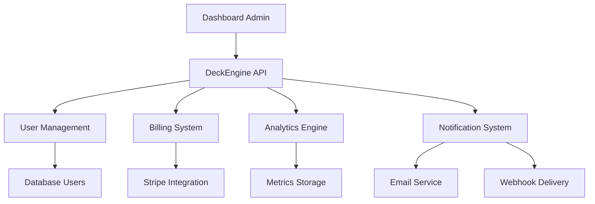

# 🏢 Guia Administrativo - PipesNow DeckEngine

> **Sistema de Administração completo para gerenciar usuários, faturamento e pipelines empresariais**

## 🎯 **Visão Geral do Sistema Admin**

O DeckEngine foi projetado para ser o **core de processamento** do seu sistema administrativo, gerenciando:

- 👥 **Gestão de Usuários** (onboarding, atualizações, billing)
- 💳 **Processamento de Faturamento** (Stripe, cobrança automática)
- 📊 **Analytics e Relatórios** (métricas de uso, performance)
- 🔔 **Notificações** (emails, webhooks, alertas)
- 🔐 **Segurança e Compliance** (auditoria, permissões)

## 🏗️ **Arquitetura do Sistema Admin**

### **Fluxo de Dados**



### **Componentes Principais**

```
admin-system/
├── 🎮 DeckEngine API          # Core de processamento
├── 👥 User Management         # Gestão de usuários
├── 💳 Billing System          # Faturamento e pagamentos
├── 📊 Analytics Dashboard     # Métricas e relatórios
├── 🔔 Notification Hub        # Sistema de notificações
└── 🔐 Security Layer          # Autenticação e autorização
```

## 👥 **Gestão de Usuários**

### **Fluxos de Usuario com DeckEngine**

#### **🆕 Onboarding de Usuário**

```javascript
// Deck: user-onboarding
const onboardingDeck = engine.createDeck("user-onboarding", {
  concurrency: 5,
  timeout: 60000,
});

onboardingDeck
  .addCard("validate-signup", async (context) => {
    // Validar dados de cadastro
    const { email, plan, paymentMethod } = context.payload;

    if (!email || !plan) {
      throw new Error("Email e plano são obrigatórios");
    }

    // Verificar se email já existe
    const existingUser = await checkExistingUser(email);
    if (existingUser) {
      throw new Error("Email já cadastrado");
    }

    return { ...context, validated: true };
  })
  .addCard("create-user-account", async (context) => {
    // Criar conta no sistema
    const user = await createUser({
      email: context.payload.email,
      plan: context.payload.plan,
      status: "pending",
    });

    return { ...context, userId: user.id, user };
  })
  .addCard("setup-billing", async (context) => {
    // Configurar faturamento no Stripe
    const customer = await stripe.customers.create({
      email: context.payload.email,
      payment_method: context.payload.paymentMethod,
      invoice_settings: {
        default_payment_method: context.payload.paymentMethod,
      },
    });

    // Criar subscription
    const subscription = await stripe.subscriptions.create({
      customer: customer.id,
      items: [{ price: context.payload.plan.priceId }],
      expand: ["latest_invoice.payment_intent"],
    });

    return {
      ...context,
      stripeCustomerId: customer.id,
      subscriptionId: subscription.id,
    };
  })
  .addCard("activate-account", async (context) => {
    // Ativar conta do usuário
    await updateUser(context.userId, {
      status: "active",
      stripeCustomerId: context.stripeCustomerId,
      subscriptionId: context.subscriptionId,
      activatedAt: new Date(),
    });

    return { ...context, accountActivated: true };
  })
  .addCard("send-welcome-email", async (context) => {
    // Enviar email de boas-vindas
    await sendEmail({
      to: context.payload.email,
      template: "welcome",
      data: {
        userName: context.user.name,
        planName: context.payload.plan.name,
        loginUrl: process.env.APP_URL,
      },
    });

    return { ...context, welcomeEmailSent: true };
  });

// Executar onboarding
const result = await engine.playAndWait("user-onboarding", {
  email: "usuario@empresa.com",
  name: "João Silva",
  plan: {
    id: "pro",
    name: "Plano Pro",
    priceId: "price_123",
  },
  paymentMethod: "pm_card_visa",
});
```

#### **🔄 Atualização de Plano**

```javascript
// Deck: plan-upgrade
const planUpgradeDeck = engine
  .createDeck("plan-upgrade")
  .addCard("validate-upgrade", async (context) => {
    const { userId, newPlan, currentPlan } = context.payload;

    // Validar se upgrade é válido
    if (newPlan.level <= currentPlan.level) {
      throw new Error("Novo plano deve ser superior ao atual");
    }

    return { ...context, upgradeValid: true };
  })
  .addCard("calculate-prorated-amount", async (context) => {
    // Calcular valor proporcional
    const prorationAmount = await calculateProration(
      context.payload.currentPlan,
      context.payload.newPlan,
      context.payload.billingCycleDay
    );

    return { ...context, prorationAmount };
  })
  .addCard("update-stripe-subscription", async (context) => {
    // Atualizar subscription no Stripe
    const subscription = await stripe.subscriptions.update(
      context.payload.subscriptionId,
      {
        items: [
          {
            id: context.payload.subscriptionItemId,
            price: context.payload.newPlan.priceId,
          },
        ],
        proration_behavior: "always_invoice",
      }
    );

    return { ...context, updatedSubscription: subscription };
  })
  .addCard("update-user-plan", async (context) => {
    // Atualizar plano no banco de dados
    await updateUser(context.payload.userId, {
      planId: context.payload.newPlan.id,
      planUpdatedAt: new Date(),
    });

    return { ...context, userPlanUpdated: true };
  })
  .addCard("send-upgrade-confirmation", async (context) => {
    // Enviar confirmação por email
    await sendEmail({
      to: context.payload.userEmail,
      template: "plan-upgrade",
      data: {
        oldPlan: context.payload.currentPlan.name,
        newPlan: context.payload.newPlan.name,
        prorationAmount: context.prorationAmount,
      },
    });

    return { ...context, confirmationSent: true };
  });
```

### **📊 Analytics de Usuários**

```javascript
// Deck: user-analytics
const userAnalyticsDeck = engine
  .createDeck("user-analytics")
  .addCard("collect-usage-metrics", async (context) => {
    const { userId, timeframe } = context.payload;

    const metrics = await collectUserMetrics(userId, timeframe);

    return {
      ...context,
      metrics: {
        apiCalls: metrics.totalApiCalls,
        dataProcessed: metrics.totalDataProcessed,
        successRate: metrics.successRate,
        averageResponseTime: metrics.avgResponseTime,
      },
    };
  })
  .addCard("calculate-billing-usage", async (context) => {
    // Calcular uso faturável
    const billingUsage = await calculateBillingUsage(
      context.payload.userId,
      context.metrics
    );

    return { ...context, billingUsage };
  })
  .addCard("generate-usage-report", async (context) => {
    // Gerar relatório de uso
    const report = {
      userId: context.payload.userId,
      period: context.payload.timeframe,
      metrics: context.metrics,
      billing: context.billingUsage,
      generatedAt: new Date(),
    };

    await saveUsageReport(report);

    return { ...context, report };
  });
```

## 💳 **Sistema de Faturamento**

### **🔄 Processamento Automático de Cobrança**

```javascript
// Deck: monthly-billing
const monthlyBillingDeck = engine.createDeck("monthly-billing", {
  concurrency: 10, // Processar 10 usuários por vez
  timeout: 300000, // 5 minutos por usuário
});

monthlyBillingDeck
  .addCard("get-active-subscriptions", async (context) => {
    // Buscar todas as subscriptions ativas
    const subscriptions = await getActiveSubscriptions();

    return { ...context, subscriptions };
  })
  .addCard("process-usage-charges", async (context) => {
    const charges = [];

    for (const subscription of context.subscriptions) {
      const usage = await calculateMonthlyUsage(subscription.userId);

      if (usage.overageAmount > 0) {
        // Criar cobrança adicional para uso excedente
        const charge = await stripe.invoiceItems.create({
          customer: subscription.stripeCustomerId,
          amount: usage.overageAmount * 100, // centavos
          currency: "brl",
          description: `Uso excedente - ${usage.overageUnits} unidades`,
        });

        charges.push(charge);
      }
    }

    return { ...context, usageCharges: charges };
  })
  .addCard("generate-invoices", async (context) => {
    // Gerar faturas no Stripe
    const invoices = [];

    for (const subscription of context.subscriptions) {
      const invoice = await stripe.invoices.create({
        customer: subscription.stripeCustomerId,
        auto_advance: true,
      });

      invoices.push(invoice);
    }

    return { ...context, invoices };
  })
  .addCard("handle-payment-failures", async (context) => {
    // Tratar falhas de pagamento
    const failedPayments = [];

    for (const invoice of context.invoices) {
      if (invoice.status === "payment_failed") {
        // Suspender conta temporariamente
        await updateUser(invoice.metadata.userId, {
          status: "suspended",
          suspendedReason: "payment_failed",
          suspendedAt: new Date(),
        });

        // Enviar notificação
        await sendPaymentFailureNotification(invoice);

        failedPayments.push(invoice);
      }
    }

    return { ...context, failedPayments };
  })
  .addCard("generate-billing-report", async (context) => {
    // Gerar relatório de faturamento
    const report = {
      totalSubscriptions: context.subscriptions.length,
      totalInvoices: context.invoices.length,
      totalRevenue: context.invoices.reduce(
        (sum, inv) => sum + inv.amount_paid,
        0
      ),
      failedPayments: context.failedPayments.length,
      usageCharges: context.usageCharges.length,
      processedAt: new Date(),
    };

    await saveBillingReport(report);

    return { ...context, billingReport: report };
  });

// Executar faturamento mensal
const billingResult = await engine.playAndWait("monthly-billing", {
  month: new Date().getMonth(),
  year: new Date().getFullYear(),
});
```

### **💰 Gestão de Receita e Métricas**

```javascript
// Deck: revenue-analytics
const revenueAnalyticsDeck = engine
  .createDeck("revenue-analytics")
  .addCard("calculate-mrr", async (context) => {
    // Calcular Monthly Recurring Revenue
    const mrr = await calculateMRR();

    return {
      ...context,
      mrr: {
        current: mrr.current,
        growth: mrr.growth,
        churnRate: mrr.churnRate,
      },
    };
  })
  .addCard("analyze-user-segments", async (context) => {
    // Analisar segmentos de usuários
    const segments = await analyzeUserSegments();

    return { ...context, segments };
  })
  .addCard("predict-churn", async (context) => {
    // Identificar usuários com risco de churn
    const churnRisk = await predictUserChurn();

    return { ...context, churnRisk };
  })
  .addCard("generate-revenue-report", async (context) => {
    // Gerar relatório executivo
    const report = {
      mrr: context.mrr,
      segments: context.segments,
      churnRisk: context.churnRisk,
      recommendations: generateRecommendations(context),
      generatedAt: new Date(),
    };

    await saveRevenueReport(report);

    return { ...context, report };
  });
```

## 📊 **Sistema de Analytics**

### **📈 Dashboard Executivo**

```javascript
// Deck: executive-dashboard
const dashboardDeck = engine
  .createDeck("executive-dashboard")
  .addCard("collect-kpis", async (context) => {
    // Coletar KPIs principais
    const kpis = await Promise.all([
      getTotalUsers(),
      getActiveUsers(),
      getMonthlyRevenue(),
      getAverageTicket(),
      getChurnRate(),
      getCustomerLifetimeValue(),
    ]);

    return {
      ...context,
      kpis: {
        totalUsers: kpis[0],
        activeUsers: kpis[1],
        monthlyRevenue: kpis[2],
        averageTicket: kpis[3],
        churnRate: kpis[4],
        customerLTV: kpis[5],
      },
    };
  })
  .addCard("analyze-trends", async (context) => {
    // Analisar tendências
    const trends = await analyzeTrends(context.kpis);

    return { ...context, trends };
  })
  .addCard("generate-alerts", async (context) => {
    // Gerar alertas baseados em thresholds
    const alerts = [];

    if (context.kpis.churnRate > 0.1) {
      alerts.push({
        type: "warning",
        message: `Churn rate alto: ${context.kpis.churnRate * 100}%`,
        action: "review_customer_satisfaction",
      });
    }

    if (context.trends.revenue.direction === "down") {
      alerts.push({
        type: "critical",
        message: "Receita em declínio",
        action: "review_pricing_strategy",
      });
    }

    return { ...context, alerts };
  })
  .addCard("update-dashboard", async (context) => {
    // Atualizar dashboard em tempo real
    await updateDashboard({
      kpis: context.kpis,
      trends: context.trends,
      alerts: context.alerts,
      lastUpdated: new Date(),
    });

    return { ...context, dashboardUpdated: true };
  });
```

### **🔍 Auditoria e Compliance**

```javascript
// Deck: audit-compliance
const auditDeck = engine
  .createDeck("audit-compliance")
  .addCard("collect-audit-logs", async (context) => {
    // Coletar logs de auditoria
    const logs = await getAuditLogs(context.payload.timeframe);

    return { ...context, auditLogs: logs };
  })
  .addCard("analyze-security-events", async (context) => {
    // Analisar eventos de segurança
    const securityEvents = context.auditLogs.filter(
      (log) => log.type === "security"
    );

    const analysis = await analyzeSecurityEvents(securityEvents);

    return { ...context, securityAnalysis: analysis };
  })
  .addCard("check-compliance", async (context) => {
    // Verificar compliance (LGPD, SOX, etc.)
    const complianceCheck = await checkCompliance({
      userDataHandling: true,
      dataRetention: true,
      accessControls: true,
      auditTrail: true,
    });

    return { ...context, complianceStatus: complianceCheck };
  })
  .addCard("generate-audit-report", async (context) => {
    // Gerar relatório de auditoria
    const report = {
      period: context.payload.timeframe,
      totalEvents: context.auditLogs.length,
      securityEvents: context.securityAnalysis.totalEvents,
      complianceScore: context.complianceStatus.score,
      issues: context.complianceStatus.issues,
      recommendations: context.complianceStatus.recommendations,
      generatedAt: new Date(),
    };

    await saveAuditReport(report);

    return { ...context, auditReport: report };
  });
```

## 🔔 **Sistema de Notificações**

### **📧 Email Automation**

```javascript
// Deck: email-automation
const emailAutomationDeck = engine
  .createDeck("email-automation")
  .addCard("segment-users", async (context) => {
    // Segmentar usuários para campanhas
    const segments = await segmentUsers(context.payload.criteria);

    return { ...context, userSegments: segments };
  })
  .addCard("personalize-content", async (context) => {
    // Personalizar conteúdo para cada segmento
    const personalizedContent = await Promise.all(
      context.userSegments.map((segment) =>
        personalizeContent(segment, context.payload.template)
      )
    );

    return { ...context, personalizedContent };
  })
  .addCard("send-bulk-emails", async (context) => {
    // Enviar emails em lote
    const emailResults = await sendBulkEmails(context.personalizedContent);

    return { ...context, emailResults };
  })
  .addCard("track-engagement", async (context) => {
    // Acompanhar engajamento
    const engagement = await trackEmailEngagement(context.emailResults);

    return { ...context, engagement };
  });
```

### **🚨 Sistema de Alertas**

```javascript
// Deck: alert-system
const alertSystemDeck = engine
  .createDeck("alert-system")
  .addCard("monitor-thresholds", async (context) => {
    // Monitorar thresholds críticos
    const thresholds = await checkThresholds([
      "server_cpu_usage",
      "database_connections",
      "api_error_rate",
      "payment_failure_rate",
    ]);

    return { ...context, thresholds };
  })
  .addCard("evaluate-alerts", async (context) => {
    // Avaliar quais alertas disparar
    const alerts = context.thresholds
      .filter((threshold) => threshold.breached)
      .map((threshold) => ({
        type: threshold.severity,
        message: threshold.message,
        action: threshold.recommendedAction,
        timestamp: new Date(),
      }));

    return { ...context, alerts };
  })
  .addCard("send-notifications", async (context) => {
    // Enviar notificações
    const notifications = await Promise.all([
      sendSlackNotifications(context.alerts),
      sendEmailAlerts(context.alerts),
      sendWebhookAlerts(context.alerts),
    ]);

    return { ...context, notifications };
  });
```

## 🔐 **Segurança e Permissões**

### **👤 Gestão de Permissões**

```javascript
// Sistema de roles e permissões
const ADMIN_ROLES = {
  super_admin: {
    permissions: ["*"], // Todas as permissões
    description: "Acesso total ao sistema",
  },
  finance_admin: {
    permissions: [
      "billing:read",
      "billing:write",
      "reports:financial",
      "users:read",
    ],
    description: "Gestão financeira e faturamento",
  },
  user_admin: {
    permissions: [
      "users:read",
      "users:write",
      "users:suspend",
      "support:tickets",
    ],
    description: "Gestão de usuários e suporte",
  },
  analytics_admin: {
    permissions: ["analytics:read", "reports:all", "dashboards:manage"],
    description: "Analytics e relatórios",
  },
};

// Deck: permission-check
const permissionDeck = engine
  .createDeck("permission-check")
  .addCard("validate-token", async (context) => {
    // Validar token de admin
    const admin = await validateAdminToken(context.payload.token);

    if (!admin) {
      throw new Error("Token inválido ou expirado");
    }

    return { ...context, admin };
  })
  .addCard("check-permissions", async (context) => {
    // Verificar permissões específicas
    const hasPermission = checkPermission(
      context.admin.role,
      context.payload.requiredPermission
    );

    if (!hasPermission) {
      throw new Error("Permissão insuficiente");
    }

    return { ...context, authorized: true };
  })
  .addCard("log-access", async (context) => {
    // Log de acesso para auditoria
    await logAdminAccess({
      adminId: context.admin.id,
      action: context.payload.action,
      resource: context.payload.resource,
      ip: context.payload.ip,
      timestamp: new Date(),
    });

    return { ...context, accessLogged: true };
  });
```

## 🎯 **Casos de Uso Práticos**

### **Cenário 1: Dashboard Administrativo**

```javascript
// Atualização em tempo real do dashboard
async function updateAdminDashboard() {
  // Executar múltiplos decks em paralelo
  const [userMetrics, revenueData, systemHealth] = await Promise.all([
    engine.playAndWait("user-analytics", { timeframe: "last_30_days" }),
    engine.playAndWait("revenue-analytics", { period: "current_month" }),
    engine.playAndWait("system-health-check", {}),
  ]);

  return {
    users: userMetrics.metrics,
    revenue: revenueData.mrr,
    system: systemHealth.status,
    lastUpdated: new Date(),
  };
}
```

### **Cenário 2: Processamento em Lote de Usuários**

```javascript
// Processar upgrade em massa
async function processBulkUpgrade(userIds, newPlan) {
  const payloads = userIds.map((userId) => ({
    userId,
    newPlan,
    processedBy: "admin_bulk_operation",
  }));

  const results = await engine.playMatches("plan-upgrade", payloads, {
    waitAll: true,
    maxConcurrency: 5,
  });

  return {
    total: results.length,
    successful: results.filter((r) => r.success).length,
    failed: results.filter((r) => !r.success).length,
    details: results,
  };
}
```

### **Cenário 3: Automação de Cobrança**

```javascript
// Executar cobrança automatizada diária
cron.schedule("0 2 * * *", async () => {
  console.log("🔄 Iniciando processamento automático de cobrança...");

  try {
    const result = await engine.playAndWait("daily-billing-check", {
      date: new Date(),
      automated: true,
    });

    console.log("✅ Cobrança processada:", result.summary);

    // Enviar relatório para admins
    await engine.playAndWait("send-admin-report", {
      type: "billing",
      data: result,
      recipients: ["admin@empresa.com"],
    });
  } catch (error) {
    console.error("❌ Erro na cobrança automática:", error);

    // Alertar equipe de emergência
    await engine.playAndWait("send-emergency-alert", {
      error: error.message,
      system: "billing",
    });
  }
});
```

## 📊 **Métricas de Negócio**

### **KPIs Principais**

```javascript
const BUSINESS_KPIS = {
  // Usuários
  totalUsers: "SELECT COUNT(*) FROM users",
  activeUsers:
    "SELECT COUNT(*) FROM users WHERE last_login > NOW() - INTERVAL 30 DAY",
  newSignups:
    "SELECT COUNT(*) FROM users WHERE created_at > NOW() - INTERVAL 7 DAY",

  // Financeiro
  mrr: "SELECT SUM(amount) FROM subscriptions WHERE status = 'active'",
  arpu: "SELECT AVG(amount) FROM subscriptions WHERE status = 'active'",
  churnRate: "SELECT (cancelled_subscriptions / total_subscriptions) * 100",

  // Operacional
  apiUsage:
    "SELECT COUNT(*) FROM api_logs WHERE created_at > NOW() - INTERVAL 24 HOUR",
  errorRate: "SELECT (error_count / total_requests) * 100",
  responseTime: "SELECT AVG(response_time) FROM api_logs",
};
```

### **Alertas de Negócio**

```javascript
const BUSINESS_ALERTS = {
  churnRateHigh: {
    condition: "churn_rate > 10",
    message: "Taxa de churn acima de 10%",
    action: "review_customer_satisfaction",
  },
  revenueDecline: {
    condition: "mrr_growth < -5",
    message: "Declínio na receita mensal",
    action: "analyze_pricing_strategy",
  },
  highErrorRate: {
    condition: "error_rate > 5",
    message: "Taxa de erro da API alta",
    action: "check_system_health",
  },
};
```

---

**🏢 Sistema Administrativo Completo com DeckEngine!** 🚀

> _"Transforme complexidade administrativa em pipelines simples e confiáveis"_ ✨

### **Próximos Passos**

1. 🛡️ **Implementar autenticação** multi-tier
2. 💾 **Configurar persistência** com MongoDB/Redis
3. 📊 **Integrar analytics** em tempo real
4. 🔔 **Ativar notificações** automáticas
5. 💳 **Conectar Stripe** para faturamento
